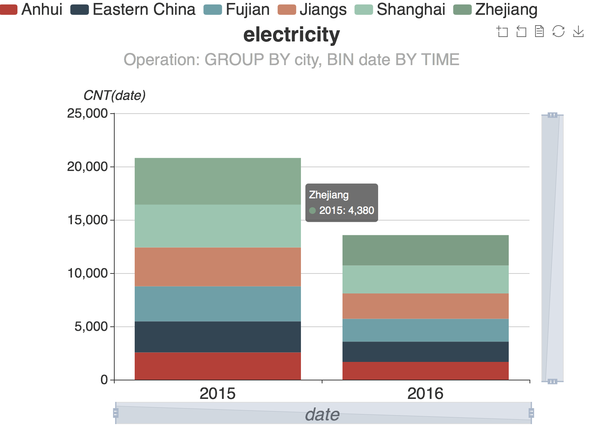

DeepEye - APIs
===========================
This repository share the APIs of the DeepEye's visualization recommendation module. A live demo of DeepEye: http://deepeye.tech

Description
===========================
### Visualization Ranking: 
the task is, given two visualization nodes, to decide which one is better. Hence we need to rank multiple visualization nodes. We support three ranking approaches:
1. **Learning-to-rank**: We use a learning-to-rank model. Roughly speaking, it is a supervised learning task that takes the input space X as lists of feature vectors, and Y the output space consisting of grades (or ranks). The goal is to learn a function F (·) from the training examples, such that given two input vectors x1 and x2, it can determine which one is better, F (x1 ) or F (x2 ). We used the LambdaMART algorithm. [More Details](http://dbgroup.cs.tsinghua.edu.cn/ligl/papers/icde18-deepeye.pdf)
2. **Parial Order-based approach**: the basic idea is that we define some partial orders which are used to decide which visualization node is better. Then we build a graph based on the partial orders, where each vertex is a visualization node and the directed edge between two nodes is decided by the partial order. At last, we can use the graph to compute a score for each visualization node based on topology sorting, i.e., the smaller the topology order is, the larger the score is. [More Details](http://dbgroup.cs.tsinghua.edu.cn/ligl/papers/icde18-deepeye.pdf)
3. **Diversified Ranking**: We aim to select diversified top-k visualization nodes since there may be many similar visualizations showing redundant information. For example, v1 > v2 and v2 > v3 do not necessarily mean that v1 + v2 > v1 + v3, since v1 and v2 might be very “similar". Our basic idea is to construct a graph in which nodes are visualizations, and weight of the edge between two nodes denotes the distance between them. Then we use the graph, our defined relevance and diversity measurement to calculate diversified top-k visualizations.

Platforms
===========================
DeepEye - APIs has been tested on **OS X**, **CentOS**, **Linux**, and **Windows 10**.

Clone from Github
===========================
If you want to get the latest source code, please clone it from Github repo with the following command.

```
https://github.com/Thanksyy/DeepEye-APIs.git
cd DeepEye-APIs
```


Usage
===========================
- ### Dependencies 
- [x] Python 2.7
- [x] MySQL 5.7
- [x] [MySQLdb](http://mysql-python.sourceforge.net/MySQLdb.html#installation)
- [x] [numpy](https://github.com/numpy/numpy)

- ### How to use
#### 1. Prepare Dataset 
DeepEye gets dataset for visualization from MySQL database. A dataset for visualization like this:

**Table Name**: electricity

city| date | electricity(kWh)
---|---| ---|
|Eastern China| 2011/1/1|   251503.28|
|Shanghai   |2011/1/1|  33764.17
|Jiangsu    |2011/1/1|  91192
|...|...|...
|Zhejiang|  2016/8/25|  110648.34
|Shanghai   |2016/8/25| 66249.55

#### 2. Execute Recommendation Algorithm
We can run the algorithm by executing *.py file, following the below guidance:
```
Python2.7 [path] [MySQLdb_arguments] [table] [SQL] [column_name] [column_type]
```
```
python2.7 /path/Learning-to-rank/learning_to_rank.py 'localhost' 3306 'root' 'dbpsd' 'scheme' 'electricity' 'SELECT * FROM `electricity`' 'city' 'date' 'electricity(kWh)' 'varchar(125)' 'date' 'float'
```
- **path**: the path of *.py file. e.g.: 
```
'/user/Learning-to-rank/learning_to_rank.py'
```

- **MySQLdb_arguments**: we should post the MySQLdb connection arguments:
```
db=_mysql.connect(host="localhost", port = 3306, user="name", passwd="pwd", db="DeepEye")
```
e.g:
```
'localhost' 3306 'name' 'pwd' 'DeepEye'
```
- **table**: the table in your MySQL database for visualization:

```
'table name'
```
- **SQL**: the SQL query on the table in your MySQL database. DeepEye visualize the sub-table which is generated by SQL query. e.g.,

```
'SELECT * FROM `electricity`'  // it means that visualize table electricity
```
or
```
'SELECT * FROM `electricity` WHERE city = "Shanghai"' // it means that visualize the electricity of 'Shanghai'
```
-  **column_name**: the columns of table for visualization, e.g.,
```
'city' 'date' 'electricity(kWh)'o
```
- **column_type**: the type of columns, following the MySQL database standard, e.g.,
```
'VARCHAR(25)' 'DATE' 'FLOAT'
```


**NOTE**: all arguments are separated by spaces


### 3. Output

The output of algorithm is JSON data, looks like:


```
{
    "order1":2, // the order in ranking result list
    "describe":"GROUP BY city, BIN date BY TIME", // transformation operation
    "x_name":"date", //  x-axis
    "y_name":"CNT(date)", //  y-axis (with aggreation)
    "chart":"bar", // visualization type
    "classify":[  // group on each bar (just for grouped bar/line/scatter chart)
        "Anhui",
        "Eastern China",
        "Fujian",
        "Jiangs",
        "Shanghai",
        "Zhejiang"
    ],
    "x_data":[ // data on x-axis
        [
            "2015",
            "2016"
        ]
    ],
    "y_data":[  //data on y-axis
        [   // for "Anhui", 2555 for "2015", 1666 for "2016"
            2555,
            1666
        ],
        [
            2920,
            1904
        ],
        [
            3285,
            2142
        ],
        [
            3650,
            2380
        ],
        [
            4015,
            2618
        ],
        [
            4380,
            2856
        ]
    ]
}
```
We can visualize the above JSON data by visualization library (such as [Echarts](https://ecomfe.github.io/echarts-doc/public/en/index.html), [vega-lite](https://github.com/vega/vega-lite)), and get a visualization likes:


Publications
===========================
- Yuyu Luo, Xueqi Qin, Nan Tang, Guoliang Li. [DeepEye: Towards Automatic Data Visualization](http://dbgroup.cs.tsinghua.edu.cn/ligl/papers/icde18-deepeye.pdf). **ICDE 2018**
- Yuyu Luo, Xuedi Qin, Nan Tang Guoliang Li, Xinran Wang. [DeepEye: Creating Good Data Visualizations by Keyword Search](http://dbgroup.cs.tsinghua.edu.cn/ligl/papers/sigmod18-deepeye.pdf). **SIGMOD 2018 Demo**

Contributors
===========================
|#|Contributor|Affiliation|Contact|
|---|----|-----|-----|
|1|[Guoliang Li](http://dbgroup.cs.tsinghua.edu.cn/ligl/)|Professor, Tsinghua University| LastName+FirstName@tsinghua.edu.cn
|2|[Nan Tang](http://da.qcri.org/ntang/index.html)|Senior Scientist, Qatar Computing Research Institute|ntang@hbku.edu.qa
|3|Xuedi Qin| PhD Candidate, Tsinghua University| qxd17@mails.tsinghua.edu.cn
|4|Yuyu Luo| M.S. Student, Tsinghua University| luoyuyu@tsinghua.edu.cn
##### If you have any questions or feedbacks about this project, please feel free to contact Yuyu Luo (luoyuyu@tsinghua.edu.cn).
